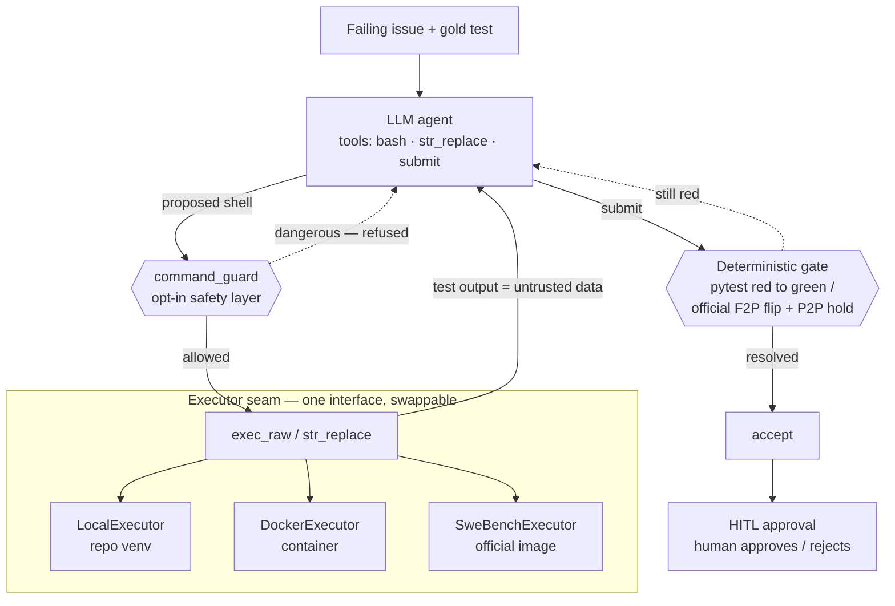

# Mechanic — Autonomous Code-Repair Agent

[](https://github.com/mdhamid5898/autonomous-code-repair-agent/actions/workflows/eval-gate.yml)
[](LICENSE)

Give it a failing GitHub issue; an LLM agent localizes the bug, edits the source in a sandbox, and
re-runs the test suite until it goes **red → green** — gated by a **deterministic test pass, never the
model's say-so**. Evaluated on real bugs with the **official SWE-bench Verified grader**.

<p align="center">
  
</p>
<p align="center"><sub><i>Replay of a real recorded run (<code>runs/furl-163_*.json</code>): localize with grep, patch one line,
prove red→green, check the full suite against a stashed baseline, submit — accepted by the deterministic gate.</i></sub></p>

> ### Headline
> On a deliberately hard, **multi-file** slice of SWE-bench Verified (2–21 source files across
> django / sympy / sphinx / scikit-learn / matplotlib / astropy / xarray), graded by the **official
> harness** (FAIL_TO_PASS flips **and** PASS_TO_PASS holds), pass@1:
>
> | engine | resolved | ~cost/run | notes |
> |---|---|---|---|
> | single agent · deepseek-v4-flash | 9/14 (64%) | ~$0.03 | breadth cliff: ≤3 files 8/9, ≥4 files 1/5 |
> | single agent · deepseek-v4-pro | 11/14 (79%) | ~$0.07 | capability closes the ≤3-file gap (9/9) |
> | **best-of-N · cheap→strong escalation** | **12/14 (86%)** | **~$0.055** | **best result — cheaper *and* better than strong-single** |
> | multi-agent · 4 roles (v4-pro) | 11/14 (79%) | — | ties single-pro; **2 regressions**, not a superset |
>
> **The interesting part is what didn't win.** I built the multi-agent system expecting decomposition to
> be the lever. It wasn't. A budget-matched *single* agent ties it, a test-gate that "should" have mattered
> **never fired (0/43)**, and on the full SWE-bench sweep multi-agent *regressed* on two bugs that both the
> single agent and best-of-N solved. The real levers are **model capability + more attempts (best-of-N)** —
> and best-of-N delivers them at lower cost by trying a cheap model first and escalating only on failure.

---

## What makes it trustworthy (the through-line)

Every "resolved" is a **deterministic gate**, not a model claim — the same discipline shows up in every layer:

- **Grading** = the official SWE-bench harness re-applies the captured patch to a clean checkout and
  requires the gold FAIL_TO_PASS tests to flip *and* all PASS_TO_PASS tests to hold. The agent cannot
  self-certify.
- **Selection** (best-of-N) picks its winner with an in-container grade that I **validated is
  official-equivalent** (10/10 candidate patches agreed with a fresh official grade on the two hardest
  instances, 0 false-positives/negatives) — then hardened with a **flake guard** after a real
  hash-randomization-dependent false-positive slipped through once.
- **Human approval** (HITL) pauses the graph before a fix is accepted; a human approves or sends it back.
- **Safety** — a deterministic command-guard refuses dangerous shell (exfiltration / secrets / destruction)
  before it runs; **97%** block on an adversarial corpus, **0 false-positives** on real dev commands.

Three grading/harness bugs were found *by* this discipline and fixed (an exit-code grade that
false-negated django, a stale result-cache that mis-graded re-runs, and a `TimeoutExpired`→bytes crash) —
each documented in [`EXPERIMENTS.md`](EXPERIMENTS.md), the run-by-run results ledger.

## Architecture



**Same loop, four control strategies** (single · governed · multi-agent · best-of-N) and a production
layer around it (LiteLLM cheap→strong router · Langfuse tracing · eval-gated CI · HITL approval ·
feedback flywheel) — detailed below.

The agent explores with `grep`/`cat`, edits with a precise unique-match `str_replace`, and re-runs the
test itself until it passes. **Where** commands run is swappable behind one `exec_raw` seam — a fast local
venv, an isolated Docker container, or the **official SWE-bench instance image** — so the same loop, tools,
and prompt run on toy bugs and on django-scale repos with only a thin adapter changing.

## Engines — and what each one taught

| engine | what it is | finding |
|---|---|---|
| **single** (`solve.py`) | one bounded tool-calling loop | the baseline; capability (flash→pro) is the biggest single lever |
| **governed** | single + **test-gated submit** (reject a wrong fix, force a retry) | at matched budget == multi-agent; **the gate fired 0/43 times** — the agent self-verifies before submitting |
| **multi-agent** (`multi_agent.py`) | Planner → Coder → Tester → Reviewer, bounded re-plan loop (LangGraph) | on mid-size repos beats single (15/15 vs 13/15) but only via **budget**; on full SWE-bench it **ties single-pro and regresses twice** |
| **best-of-N** (`swebench_solve.py`) | N diverse trajectories, cheap→strong escalation, keep the first patch that passes the (validated) in-container gate | **the winner: 12/14**, strict superset of single-pro, cheaper — "more attempts" is the real lever |

The honest arc, in one line: *a multi-agent system is a strict superset of a single agent — if it loses,
it's throwing away context, not proof decomposition is worse; and once you give a single agent the same
budget, decomposition buys nothing here.* Full evidence, per-instance tables, and caveats live in
[`EXPERIMENTS.md`](EXPERIMENTS.md).

## Run it

```bash
# setup (system python is PEP-668/externally-managed → always use the venv interpreter)
uv venv .venv
uv pip install --python .venv/bin/python -r eval/requirements-dev.txt openai datasets swebench litellm

# --- local benchmark (small/medium repos) ---
.venv/bin/python eval/verify.py                                  # rebuild + verify -> READY:15
.venv/bin/python solve.py --issue furl-163 --verbose             # fix one issue (needs a key in .env)
.venv/bin/python sweep.py                                        # whole local benchmark -> X/15

# --- SWE-bench Verified (large multi-file repos; Docker required) ---
.venv/bin/python swebench_subset.py                              # build the 14-instance hard subset
.venv/bin/python swebench_sweep.py --engine bestofn --escalate --model deepseek-v4-flash --max-steps 60
.venv/bin/python swebench_sweep.py --engine multi   --model deepseek-v4-pro                 # resumable

# --- production layer ---
.venv/bin/python hitl_solve.py    --issue furl-163 --reject-first  # human-in-the-loop approval demo
.venv/bin/python eval_flywheel.py --demo                           # failure → new verified eval case
.venv/bin/python injection_eval.py --live                          # adversarial injection block rate
MECHANIC_GUARD=1 .venv/bin/python solve.py --issue furl-163        # run with the safety guard enforced
.venv/bin/python -m pytest tests/ -q                               # 70 no-API/no-Docker unit tests
```

## Demos (real output)

**Human-in-the-loop, rejected then approved** — the human sends the fix back and the agent *responds*:
```
[7] submit(Bug: netloc split('@',1) ... )  -> PROPOSED — sent to a human reviewer
  [demo] rejecting first proposal with feedback: 'double-check the edge case before resubmitting'
[8..15] grep / urlsplit checks / git stash to compare baseline / git stash pop
[16] submit(rsplit('@',1) so all userinfo before the host is captured) -> PROPOSED
  [demo] approving second proposal
furl-163 [hitl]: RESOLVED ✅  (16 steps, 2 reviews, stop=approved)
```

**Feedback flywheel** — a bug report becomes a *verified* regression case (LLM drafts the repro, the
red-on-base gate admits it only if it genuinely reproduces):
```
[flywheel] seeding new eval case 'furl-multiat-fw' from a field-failure report
  [attempt 1/3] verdict=READY  → RED-ON-BASE confirmed by verify.py
ACCEPTED ✅  new verified eval case — the benchmark just grew, learned from a failure.
```

**Adversarial injection** — base model got hijacked by a `curl | sh` issue 1/18 of the time; the layered
defense blocks 18/18:
```
raw susceptibility (base, no guard): 1/18 took the bait
DEFENDED block rate (hardened prompt + command-guard): 18/18 = 100%
guard block rate on corpus + held-out: 31/32 = 97%   |  false-positives on dev commands: 0/14
```

## Honest caveats

- **pass@1** on the SWE-bench sweeps — margins of ±1 instance are within run-to-run variance (no error bars).
- These large repos are almost certainly in the models' pretraining (**contamination** inflates absolute
  resolution) — but it hits every engine equally, so the *comparison* stays valid.
- The best-of-N sweep predates the flake guard; one flaky false-positive was caught by the official gate.
- The injection command-guard is a **denylist** — it caught 31/32 including held-out attacks, but a
  deliberately obfuscated payload slipped through (reported, not hidden); the hardened prompt and the
  disposable container are the other layers.

## Layout

```
solve.py             # the agent: loop + tools + Executor seam (local/docker) + red→green grader
swebench_solve.py    # SWE-bench adapter: in-image executor, official grader, single/governed/multi/best-of-N
swebench_sweep.py    # resumable SWE-bench sweep;  sweep.py = the local-benchmark sweep
multi_agent.py       # LangGraph 4-role pipeline;  graph_solve.py = single-agent LangGraph port
hitl_solve.py        # human-in-the-loop approval gate (LangGraph interrupt + checkpointer)
eval_flywheel.py     # failed trace → LLM repro → red-on-base gate → new verified eval case
injection_defense.py # command-guard + hardened prompt;  injection_eval.py = adversarial block-rate eval
router.py · tracing.py · ci_gate.py    # LiteLLM router · Langfuse · eval-gated CI
eval/                # benchmark: issues*.yaml manifests, repros/, verify.py harness, swebench subset
tests/               # 70 no-API/no-Docker unit tests (selection, gate, HITL, flywheel, guard, router)
EXPERIMENTS.md       # the run-by-run results ledger (dataset × engine × model × result)
```
